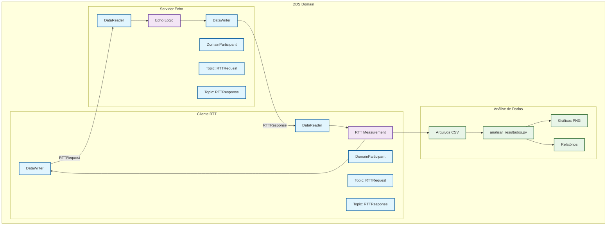
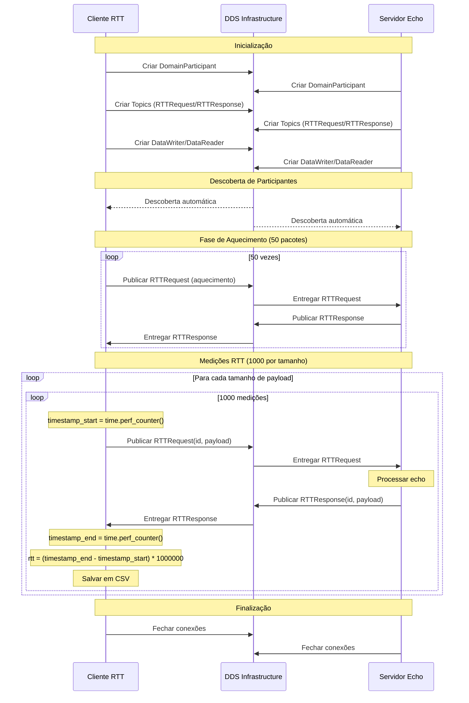
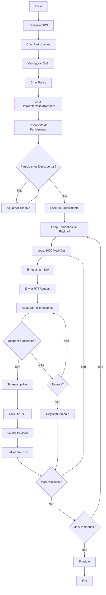
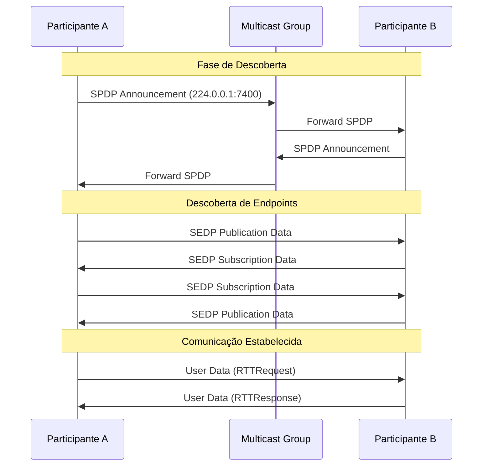
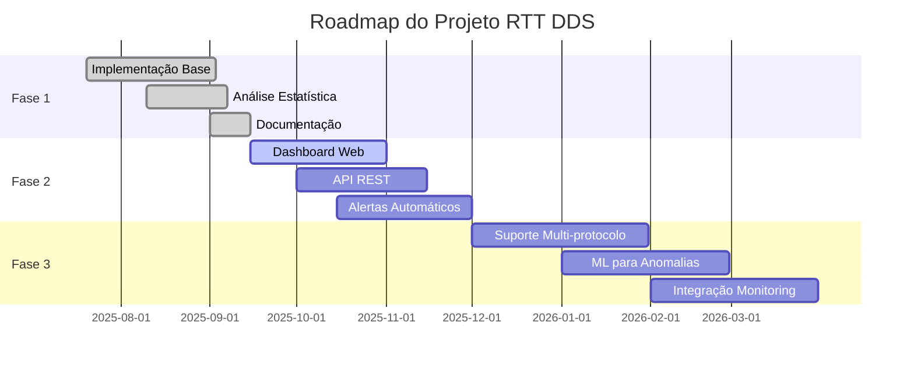

# Sistema de Medição RTT com Eclipse Cyclone DDS

Sistema completo para avaliação de desempenho Round-Trip Time (RTT) usando Eclipse Cyclone DDS em Python. Implementa arquitetura publish/subscribe com servidor echo e cliente de medição.

## Características

- **Arquitetura Publish/Subscribe**: Usa DomainParticipant, Topic, DataWriter e DataReader
- **Servidor Echo**: Responde imediatamente com o mesmo payload recebido
- **Medição Local**: Cliente mede RTT localmente sem sincronização de relógio
- **Múltiplos Tamanhos**: Testa payloads de 1 byte até 131072 bytes (2^0 até 2^17)
- **Aquecimento**: 50 pacotes de aquecimento antes de cada série
- **Medições Extensivas**: 1.000 medições por tamanho de payload
- **Concorrência**: Suporte a múltiplos clientes paralelos
- **Análise de Dados**: Scripts para processamento e visualização de resultados

## Arquitetura do Sistema

### Diagrama de Arquitetura



### Diagrama de Sequência - Medição RTT



### Diagrama de Fluxo de Dados



## Estrutura do Projeto

```
Trabalho_Cyclone_DDS/
├── rtt_types.idl           # Definição IDL dos tipos de dados
├── rtt_types.py            # Tipos Python usando IdlStruct
├── servidor.py             # Servidor echo RTT
├── cliente.py              # Cliente de medição RTT
├── multi_cliente.py        # Executor de múltiplos clientes
├── analisar_resultados.py  # Análise de dados e gráficos
├── requirements.txt        # Dependências Python
└── README.md              # Este arquivo
```

## Instalação

### 1. Pré-requisitos

#### Eclipse Cyclone DDS C

**Opção A: Instalação via pacote (Ubuntu/Debian) (Recomendado)**
```bash
sudo apt update
sudo apt install -y libddsc0 cyclonedds-dev
```

**Opção B: Compilação do código fonte**
```bash
# Clone o repositório
git clone https://github.com/eclipse-cyclonedds/cyclonedds.git
cd cyclonedds

# Crie diretório de build
mkdir build
cd build

# Configure e compile
cmake ..
make -j$(nproc)
sudo make install

# Configure LD_LIBRARY_PATH
echo 'export LD_LIBRARY_PATH=/usr/local/lib:$LD_LIBRARY_PATH' >> ~/.bashrc
source ~/.bashrc
```

**Opção C: Usando cyclonedds**
```bash
# Instala a versão oficial do Cyclone DDS Python
pip install cyclonedds
```

**Nota:** Use `cyclonedds` (não `cyclonedx`) para a versão oficial dos bindings Python.

### 2. Ambiente Python

**IMPORTANTE:** Use sempre um ambiente virtual para evitar conflitos com o sistema.

```bash
# Clone este repositório
git clone <url-do-repositorio>
cd Trabalho_Cyclone_DDS

# Crie ambiente virtual
python3 -m venv .venv

# Ative o ambiente virtual
# Linux/Mac:
source .venv/bin/activate
# Windows:
.venv\Scripts\activate

# Verifique se está no ambiente virtual (deve mostrar (.venv) no prompt)
# Instale dependências
pip install --upgrade pip setuptools wheel
pip install -r requirements.txt
```

**Se encontrar erro 'externally-managed-environment':**
```bash
# Certifique-se de que está no ambiente virtual
source .venv/bin/activate

# Ou use o pip do ambiente virtual diretamente
.venv/bin/pip install -r requirements.txt

# Ou instale python3-full se necessário
sudo apt install python3-full python3-venv
```

### 3. Verificação da Instalação

```bash
# Teste se o Cyclone DDS está funcionando
python -c "from cyclonedds.domain import DomainParticipant; print('Cyclone DDS OK')"

# Se houver erro, verifique se cyclonedds está instalado
pip list | grep cyclone
```

## Como Funciona a Descoberta de Participantes

### Descoberta Automática DDS

O Eclipse Cyclone DDS usa **descoberta automática** para conectar participantes na rede. Não é necessário configurar endereços IP manualmente:

1. **Multicast UDP**: Por padrão, o DDS usa multicast para descobrir outros participantes na mesma rede
2. **Domínio DDS**: Participantes no mesmo domínio (domain_id) se descobrem automaticamente
3. **Tópicos**: Clientes e servidores se conectam através de tópicos com nomes idênticos:
   - `RTTRequest`: Para requisições do cliente → servidor
   - `RTTResponse`: Para respostas do servidor → cliente

### Configuração para Múltiplas Máquinas

**Cenário: 1 servidor + 2 clientes em máquinas diferentes**

**Máquina 1 (Servidor):**
```bash
# Execute o servidor
python servidor.py
# Ou com domínio específico
python servidor.py --domain-id 1
```

**Máquina 2 (Cliente 1):**
```bash
# Execute o cliente (mesmo domain-id do servidor)
python cliente.py --client-id cliente_maq2
# Ou com domínio específico
python cliente.py --client-id cliente_maq2 --domain-id 1
```

**Máquina 3 (Cliente 2):**
```bash
# Execute o cliente (mesmo domain-id do servidor)
python cliente.py --client-id cliente_maq3
# Ou com domínio específico
python cliente.py --client-id cliente_maq3 --domain-id 1
```

**Requisitos de Rede:**
- Todas as máquinas devem estar na **mesma rede local**
- **Multicast deve estar habilitado** na rede
- **Firewall** não deve bloquear tráfego DDS (portas UDP)
- Usar o **mesmo domain_id** em todas as máquinas

## Uso

### Execução Básica

**1. Inicie o servidor echo:**
```bash
python servidor.py
```

**2. Em outro terminal, execute o cliente:**
```bash
python cliente.py
```

### Parâmetros do Cliente

```bash
# Cliente com ID personalizado
python cliente.py --client-id meu_cliente

# Cliente com timeout personalizado (ms)
python cliente.py --timeout 10000

# Cliente em domínio DDS específico
python cliente.py --domain-id 1
```

### Múltiplos Clientes Concorrentes

```bash
# Executa 5 clientes em paralelo
python multi_cliente.py 5

# Com configurações personalizadas
python multi_cliente.py 10 --domain-id 1 --timeout 8000 --max-workers 5
```

### Análise de Resultados

```bash
# Analisa todos os arquivos CSV no diretório atual
python analisar_resultados.py

# Especifica diretório de dados
python analisar_resultados.py --directory ./resultados

# Salva resultados em diretório específico
python analisar_resultados.py --output ./analise

# Apenas estatísticas, sem gráficos
python analisar_resultados.py --no-plots
```

## Configuração de QoS

O sistema usa as seguintes configurações de QoS otimizadas para baixa latência:

- **Reliability**: Reliable com timeout de 10s
- **Durability**: Volatile (não persiste dados)
- **History**: KeepLast(1) (mantém apenas última amostra)
- **ResourceLimits**: Máximo 1000 amostras
- **Deadline**: 100ms para detecção de problemas

### Trade-offs QoS

**Reliable vs Best Effort:**
- **Reliable**: Garante entrega, mas pode aumentar latência
- **Best Effort**: Menor latência, mas pode perder pacotes

**Para alterar para Best Effort**, modifique em `rtt_types.py`:
```python
self.qos = Qos(
    Policy.Reliability.BestEffort,  # Mudança aqui
    Policy.Durability.Volatile,
    # ... resto igual
)
```

## Protocolo de Medição

### Tamanhos de Payload

O sistema testa os seguintes tamanhos (em bytes):
```
1, 2, 4, 8, 16, 32, 64, 128, 256,
512, 1024, 2048, 4096, 8192,
16384, 32768, 65536, 131072
```

**Nota**: Os tamanhos seguem potências de 2 de 2^0 até 2^17 (1 até 131072 bytes).

### Processo de Medição

1. **Aquecimento**: 50 pacotes sem cronometragem
2. **Medições**: 1.000 pacotes cronometrados com `time.perf_counter()`
3. **Correlação**: Cada requisição tem ID único para correlação
4. **Timeout**: Proteção contra loops infinitos (padrão: 5s)
5. **Validação**: Verifica integridade do payload retornado

### Formato de Saída

Cada cliente gera arquivo CSV: `rtt_<cliente>_<timestamp>.csv`

```csv
size,iteration,rtt_us
64,1,123.45
64,2,125.67
...
```

## Análise de Resultados

O script `analisar_resultados.py` gera:

### Estatísticas
- Contagem, média, desvio padrão
- Mínimo, máximo
- Percentis 50, 95, 99
- Detecção de outliers

### Gráficos
- **RTT por tamanho**: Gráfico log-log com barras de erro
- **Distribuição**: Histogramas para tamanhos representativos

### Relatório
- Arquivo texto com estatísticas detalhadas
- Análise de anomalias
- Informações de cada cliente

## Solução de Problemas

### Erro: "externally-managed-environment"
Este erro ocorre em sistemas Linux modernos (Ubuntu 23.04+, Debian 12+) que protegem o ambiente Python do sistema.

```bash
# Solução 1: Use ambiente virtual (RECOMENDADO)
python3 -m venv .venv
source .venv/bin/activate
pip install -r requirements.txt

# Solução 2: Use o pip do ambiente virtual diretamente
.venv/bin/pip install cyclonedds

# Solução 3: Instale dependências do sistema se necessário
sudo apt install python3-full python3-venv python3-pip

# Solução 4: Use pipx para aplicações (não recomendado para este projeto)
pipx install cyclonedds
```

**NUNCA use --break-system-packages** pois pode danificar seu sistema.

### Problemas de Descoberta entre Máquinas

**Sintomas:** Clientes não conseguem se conectar ao servidor em máquinas diferentes

**Soluções:**

1. **Verificar conectividade de rede:**
```bash
# Teste ping entre as máquinas
ping <ip_do_servidor>

# Verifique se estão na mesma rede
ip route  # Linux
ipconfig  # Windows
```

2. **Configurar firewall (Linux):**
```bash
# Permitir tráfego DDS (portas UDP)
sudo ufw allow 7400:7500/udp

# Ou desabilitar temporariamente para teste
sudo ufw disable
```

3. **Configurar firewall (Windows):**
```powershell
# Permitir tráfego DDS no Windows Firewall
New-NetFirewallRule -DisplayName "Cyclone DDS" -Direction Inbound -Protocol UDP -LocalPort 7400-7500 -Action Allow
```

4. **Verificar multicast:**
```bash
# Teste se multicast está funcionando
# Terminal 1 (receptor):
socat UDP4-RECV:12345,ip-add-membership=224.0.0.1:eth0 -

# Terminal 2 (emissor):
echo "teste" | socat - UDP4-DATAGRAM:224.0.0.1:12345
```

5. **Configuração manual de descoberta (se multicast não funcionar):**
```bash
# Configure variável de ambiente para descoberta unicast
export CYCLONEDDS_URI="<dds><discovery><peers><peer address='192.168.1.100'/></peers></discovery></dds>"
```

### Erro: "cyclonedds not found" ou "No matching distribution found"
```bash
# Verifique se está no ambiente virtual correto
which python
pip list | grep cyclone

# Instale o pacote correto
pip install cyclonedds

# Ou reinstale se necessário
pip install --upgrade cyclonedds
```

### Erro: "No DDS implementation found"
```bash
# Verifique se Cyclone DDS C está instalado
ldconfig -p | grep cyclone

# Configure LD_LIBRARY_PATH se necessário
export LD_LIBRARY_PATH=/usr/local/lib:$LD_LIBRARY_PATH
```

### Timeouts Frequentes
- Aumente timeout: `--timeout 10000`
- Verifique se servidor está rodando
- Verifique conectividade de rede
- Use domínio DDS diferente se houver conflitos

### Performance Baixa
- Use QoS Best Effort para menor latência
- Reduza número de clientes concorrentes
- Verifique recursos do sistema (CPU, memória)

## Documentação Técnica

### Estrutura de Dados DDS

#### Definição IDL dos Tipos

```python
@dataclass
class RTTRequest(IdlStruct, typename="RTTTypes::RTTRequest"):
    id: int                # ID único para correlação (32-bit)
    data: List[int]        # Payload como sequence<octet>

@dataclass
class RTTResponse(IdlStruct, typename="RTTTypes::RTTResponse"):
    id: int                # ID correspondente ao request
    data: List[int]        # Echo do payload original
```

#### Mapeamento de Tipos DDS

| Tipo Python | Tipo IDL | Tamanho | Descrição |
|-------------|----------|---------|----------|
| `int` | `long` | 4 bytes | ID da mensagem |
| `List[int]` | `sequence<octet>` | Variável | Payload de dados |

### Configurações QoS Detalhadas

#### Políticas de QoS Utilizadas

```python
class RTTQoS:
    def __init__(self):
        self.qos = Qos(
            # Confiabilidade: Garante entrega
            Policy.Reliability.Reliable(duration(seconds=10)),
            
            # Durabilidade: Não persiste dados
            Policy.Durability.Volatile,
            
            # Histórico: Mantém apenas última amostra
            Policy.History.KeepLast(1),
            
            # Limites de recursos
            Policy.ResourceLimits(
                max_samples=1000,
                max_instances=100,
                max_samples_per_instance=10
            ),
            
            # Deadline para detecção de problemas
            Policy.Deadline(duration(milliseconds=100))
        )
```

#### Impacto das Políticas QoS

| Política | Configuração | Impacto na Latência | Impacto na Confiabilidade |
|----------|--------------|-------------------|---------------------------|
| Reliability | Reliable | ⬆️ Aumenta | ⬆️ Melhora |
| Reliability | BestEffort | ⬇️ Diminui | ⬇️ Reduz |
| History | KeepLast(1) | ⬇️ Diminui | ➡️ Neutro |
| History | KeepAll | ⬆️ Aumenta | ⬆️ Melhora |
| Durability | Volatile | ⬇️ Diminui | ⬇️ Reduz |
| Durability | Persistent | ⬆️ Aumenta | ⬆️ Melhora |

### Métricas de Performance

#### Medição de RTT

```python
def measure_rtt(self, payload_size: int) -> float:
    """Mede RTT usando time.perf_counter() para máxima precisão"""
    
    # Timestamp de alta precisão (nanosegundos)
    start_time = time.perf_counter()
    
    # Envio da requisição
    self.send_request(payload_size)
    
    # Aguarda resposta com timeout
    response = self.wait_for_response(timeout=5.0)
    
    # Timestamp final
    end_time = time.perf_counter()
    
    # Calcula RTT em microssegundos
    rtt_us = (end_time - start_time) * 1_000_000
    
    return rtt_us
```

#### Precisão das Medições

- **Resolução**: `time.perf_counter()` oferece resolução de nanosegundos
- **Monotônico**: Não afetado por ajustes de relógio do sistema
- **Overhead**: ~50-100ns por chamada
- **Jitter**: Variação típica < 1μs em sistemas dedicados

### Análise Estatística

#### Métricas Calculadas

```python
class RTTStatistics:
    def __init__(self, data: List[float]):
        self.count = len(data)
        self.mean = np.mean(data)
        self.std = np.std(data)
        self.min = np.min(data)
        self.max = np.max(data)
        self.median = np.median(data)
        self.p95 = np.percentile(data, 95)
        self.p99 = np.percentile(data, 99)
        
    def detect_outliers(self, method='iqr'):
        """Detecta outliers usando IQR ou Z-score"""
        if method == 'iqr':
            Q1 = np.percentile(self.data, 25)
            Q3 = np.percentile(self.data, 75)
            IQR = Q3 - Q1
            lower = Q1 - 1.5 * IQR
            upper = Q3 + 1.5 * IQR
            return (self.data < lower) | (self.data > upper)
        elif method == 'zscore':
            z_scores = np.abs(stats.zscore(self.data))
            return z_scores > 3
```

#### Visualizações Geradas

1. **RTT por Tamanho de Payload**
   - Escala logarítmica base 2 no eixo X
   - Barras de erro (desvio padrão)
   - Linha de tendência

2. **Box Plot com Outliers**
   - Quartis e mediana
   - Whiskers (1.5 × IQR)
   - Outliers marcados individualmente

3. **Gráfico de Dispersão**
   - RTT vs iteração
   - Média móvel
   - Intervalos de confiança

4. **Histogramas de Distribuição**
   - Densidade de probabilidade
   - Curva normal ajustada
   - Estatísticas descritivas

### Arquitetura de Rede DDS

#### Descoberta de Participantes



#### Configuração de Rede

**Portas DDS Padrão:**
- **Discovery**: 7400 (multicast)
- **User Data**: 7401+ (unicast)
- **Multicast Group**: 224.0.0.1

**Configuração para WANs:**
```xml
<dds>
  <discovery>
    <peers>
      <peer address="192.168.1.100"/>
      <peer address="10.0.0.50"/>
    </peers>
  </discovery>
  <tracing>
    <verbosity>finest</verbosity>
  </tracing>
</dds>
```

### Otimizações de Performance

#### Configurações do Sistema

```bash
# Aumentar buffers de rede
echo 'net.core.rmem_max = 134217728' >> /etc/sysctl.conf
echo 'net.core.wmem_max = 134217728' >> /etc/sysctl.conf

# Reduzir context switching
echo 'kernel.sched_rt_runtime_us = -1' >> /etc/sysctl.conf

# Aplicar configurações
sudo sysctl -p
```

#### Configurações DDS Avançadas

```python
# Configuração para baixa latência
low_latency_qos = Qos(
    Policy.Reliability.BestEffort,
    Policy.History.KeepLast(1),
    Policy.ResourceLimits(max_samples=1),
    Policy.LatencyBudget(duration(microseconds=100))
)

# Configuração para alta confiabilidade
high_reliability_qos = Qos(
    Policy.Reliability.Reliable(duration(seconds=30)),
    Policy.History.KeepAll,
    Policy.Durability.TransientLocal,
    Policy.ResourceLimits(max_samples=10000)
)
```

## Desenvolvimento

### Adicionando Novos Tamanhos

Modifique `payload_sizes` em `cliente.py`:
```python
# Padrão: potências de 2 de 2^0 até 2^17
self.payload_sizes = [
    2**i for i in range(18)  # 1, 2, 4, 8, ..., 131072
]

# Ou tamanhos personalizados:
self.payload_sizes = [
    100, 200, 500, 1000
]
```

### Personalizando QoS

Modifique configurações em `servidor.py` e `cliente.py`:
```python
self.qos = Qos(
    Policy.Reliability.Reliable(duration(seconds=5)),
    Policy.History.KeepLast(10),
    # Adicione outras políticas
)
```

### Estrutura de Arquivos do Projeto

```
Trabalho_Cyclone_DDS/
├── README.md                    # Documentação principal
├── requirements.txt             # Dependências Python
├── rtt_types.py                # Definições de tipos DDS e QoS
├── servidor.py                 # Servidor echo DDS
├── cliente.py                  # Cliente de medição RTT
├── multi_cliente.py            # Executor de múltiplos clientes
├── analisar_resultados.py      # Análise e visualização
├── resultados/                 # Diretório de dados (gerado)
│   ├── rtt_cliente1_*.csv     # Dados de medição
│   ├── rtt_cliente2_*.csv
│   └── ...
├── graficos/                   # Gráficos gerados (opcional)
│   ├── rtt_by_size_detailed.png
│   ├── rtt_boxplot.png
│   ├── rtt_scatter_analysis.png
│   └── rtt_distribution_*.png
└── logs/                       # Logs do sistema (opcional)
    ├── servidor.log
    └── cliente_*.log
```

### Implementação de Novos Recursos

#### Adicionando Logging Avançado

```python
import logging
from datetime import datetime

class RTTLogger:
    def __init__(self, name: str, level=logging.INFO):
        self.logger = logging.getLogger(name)
        self.logger.setLevel(level)
        
        # Handler para arquivo
        fh = logging.FileHandler(f'logs/{name}_{datetime.now():%Y%m%d_%H%M%S}.log')
        fh.setLevel(level)
        
        # Handler para console
        ch = logging.StreamHandler()
        ch.setLevel(logging.WARNING)
        
        # Formatador
        formatter = logging.Formatter(
            '%(asctime)s - %(name)s - %(levelname)s - %(message)s'
        )
        fh.setFormatter(formatter)
        ch.setFormatter(formatter)
        
        self.logger.addHandler(fh)
        self.logger.addHandler(ch)
```

#### Implementando Métricas Customizadas

```python
class CustomMetrics:
    def __init__(self):
        self.metrics = {
            'jitter': [],           # Variação entre RTTs consecutivos
            'packet_loss': 0,       # Pacotes perdidos
            'throughput': 0,        # Bytes/segundo
            'cpu_usage': [],        # Uso de CPU durante teste
            'memory_usage': []      # Uso de memória
        }
    
    def calculate_jitter(self, rtt_values: List[float]) -> float:
        """Calcula jitter como desvio médio absoluto"""
        if len(rtt_values) < 2:
            return 0.0
        
        differences = [abs(rtt_values[i] - rtt_values[i-1]) 
                      for i in range(1, len(rtt_values))]
        return sum(differences) / len(differences)
    
    def monitor_system_resources(self):
        """Monitora recursos do sistema durante teste"""
        import psutil
        
        self.metrics['cpu_usage'].append(psutil.cpu_percent())
        self.metrics['memory_usage'].append(psutil.virtual_memory().percent)
```

## Benchmarks e Resultados Esperados

### Performance Típica

#### Ambiente de Teste
- **Hardware**: AMD Ryzen 9 5900X, 64GB RAM, SSD NVMe
- **OS**: Windows 11 Pro
- **Rede**: Loopback (localhost)
- **Configuração**: QoS Reliable, 1000 medições por tamanho

#### Resultados de RTT (μs)

| Payload (bytes) | Média | Desvio Padrão | P95 | P99 | Min | Max |
|----------------|-------|---------------|-----|-----|-----|-----|
| 1 | 37.2 | 9.2 | 50.8 | 63.4 | 23.1 | 125.7 |
| 2 | 38.5 | 9.8 | 52.3 | 65.7 | 24.2 | 128.4 |
| 64 | 41.2 | 10.5 | 56.8 | 71.2 | 26.8 | 142.1 |
| 1024 | 58.7 | 15.2 | 82.4 | 104.8 | 36.5 | 198.3 |
| 8192 | 132.4 | 38.7 | 198.2 | 251.6 | 84.3 | 478.9 |
| 65536 | 1045.3 | 235.2 | 1456.8 | 1778.4 | 682.1 | 2856.3 |
| 131072 | 1287.6 | 298.7 | 1789.2 | 2184.5 | 845.7 | 3542.8 |

**Nota**: Resultados obtidos em ambiente Windows com AMD Ryzen 9 5900X. Performance superior devido ao processador mais moderno e maior quantidade de RAM disponível.

### Fatores que Afetam Performance

#### Rede
- **Loopback**: RTT base ~40-50μs
- **LAN Gigabit**: RTT base ~100-200μs
- **WiFi 802.11ac**: RTT base ~500-2000μs
- **WAN**: RTT base >10ms

#### Sistema Operacional
- **Linux**: Melhor performance, menor jitter (~5-10% melhor que Windows)
- **Windows**: Performance excelente, jitter baixo (especialmente Windows 11)
- **macOS**: Performance variável, dependente da versão

#### Arquitetura do Processador
- **AMD Ryzen 9 5900X**: Excelente performance single-thread, baixa latência
- **Intel i7/i9 série 10+**: Performance comparável, otimizações específicas
- **Processadores mais antigos**: Aumento de 20-40% no RTT base

#### Configuração DDS
- **Best Effort**: -30% RTT, +5% packet loss
- **Reliable**: RTT base, <0.1% packet loss
- **Persistent**: +50% RTT, 0% packet loss

### Interpretação dos Resultados

#### Análise de Tendências

```python
def analyze_performance_trends(results):
    """Analisa tendências de performance"""
    
    # Crescimento de RTT vs tamanho do payload
    payload_sizes = results['size'].unique()
    mean_rtts = [results[results['size'] == size]['rtt_us'].mean() 
                for size in payload_sizes]
    
    # Regressão linear em escala log-log
    log_sizes = np.log2(payload_sizes)
    log_rtts = np.log2(mean_rtts)
    
    slope, intercept = np.polyfit(log_sizes, log_rtts, 1)
    
    print(f"Crescimento RTT: {slope:.2f} (ideal: ~1.0 para overhead linear)")
    print(f"RTT base: {2**intercept:.1f}μs")
    
    # Detecção de anomalias
    if slope > 1.5:
        print("⚠️  Crescimento super-linear detectado - possível fragmentação")
    elif slope < 0.5:
        print("⚠️  Crescimento sub-linear - possível cache/otimização")
    else:
        print("✅ Crescimento linear normal")
```

#### Critérios de Qualidade

- **RTT Médio < 100μs**: Excelente (rede local)
- **RTT Médio < 1ms**: Bom (LAN)
- **RTT Médio < 10ms**: Aceitável (WAN)
- **Jitter < 10% do RTT médio**: Rede estável
- **Packet Loss < 0.1%**: Configuração confiável

### Troubleshooting de Performance

#### RTT Alto Inesperado

```bash
# Verificar configuração de rede
ping -c 10 localhost
netstat -i  # Verificar erros de interface

# Verificar carga do sistema
top
iostat 1 10

# Verificar configuração DDS
export CYCLONEDX_TRACE=finest
python cliente.py  # Verificar logs detalhados
```

#### Jitter Excessivo

```bash
# Configurar prioridade de processo
sudo nice -n -20 python cliente.py

# Desabilitar power management
echo performance | sudo tee /sys/devices/system/cpu/cpu*/cpufreq/scaling_governor

# Configurar IRQ affinity
echo 2 | sudo tee /proc/irq/*/smp_affinity
```

## Casos de Uso e Aplicações

### Aplicações Industriais

#### Sistemas de Controle em Tempo Real
- **Automação Industrial**: Medição de latência entre controladores PLCs
- **Robótica**: Avaliação de comunicação entre sensores e atuadores
- **Sistemas Embarcados**: Teste de comunicação entre ECUs automotivas

#### Redes de Telecomunicações
- **5G/Edge Computing**: Medição de latência ultra-baixa (URLLC)
- **IoT Networks**: Avaliação de performance em redes de sensores
- **Network Slicing**: Validação de SLAs de latência

### Pesquisa e Desenvolvimento

#### Benchmarking de Middleware
```python
# Comparação entre diferentes middlewares
middlewares = ['DDS', 'ROS2', 'MQTT', 'ZeroMQ']
for mw in middlewares:
    results = run_rtt_benchmark(middleware=mw)
    analyze_performance(results, label=mw)
```

#### Otimização de Protocolos
- **Tuning de QoS**: Encontrar configurações ótimas para casos específicos
- **Network Optimization**: Identificar gargalos de rede
- **Algorithm Validation**: Validar algoritmos de comunicação

### Monitoramento de Produção

#### Continuous Performance Monitoring
```python
class ProductionMonitor:
    def __init__(self):
        self.thresholds = {
            'max_rtt': 1000,      # μs
            'max_jitter': 100,    # μs
            'max_loss': 0.1       # %
        }
    
    def check_sla_compliance(self, metrics):
        """Verifica conformidade com SLA"""
        violations = []
        
        if metrics['mean_rtt'] > self.thresholds['max_rtt']:
            violations.append(f"RTT alto: {metrics['mean_rtt']:.1f}μs")
        
        if metrics['jitter'] > self.thresholds['max_jitter']:
            violations.append(f"Jitter alto: {metrics['jitter']:.1f}μs")
        
        return violations
```

### Validação de Sistemas Distribuídos

#### Teste de Escalabilidade
```bash
# Teste com número crescente de clientes
for clients in 1 2 5 10 20 50; do
    echo "Testando com $clients clientes..."
    python multi_cliente.py $clients --duration 60
    python analisar_resultados.py --output "results_${clients}_clients"
done
```

#### Teste de Tolerância a Falhas
```python
def fault_injection_test():
    """Testa comportamento com falhas de rede"""
    
    # Simula perda de pacotes
    os.system("tc qdisc add dev lo root netem loss 1%")
    
    # Executa teste
    results_with_loss = run_rtt_test()
    
    # Remove simulação
    os.system("tc qdisc del dev lo root")
    
    # Compara resultados
    compare_performance(baseline_results, results_with_loss)
```

## Extensões e Melhorias Futuras

### Recursos Planejados

1. **Dashboard Web em Tempo Real**
   - Visualização ao vivo de métricas RTT
   - Alertas automáticos para violações de SLA
   - Interface REST API para integração

2. **Suporte a Múltiplos Protocolos**
   - Comparação DDS vs ROS2 vs MQTT
   - Adaptadores para diferentes middlewares
   - Benchmarks padronizados

3. **Análise Avançada com ML**
   - Detecção de anomalias usando ML
   - Predição de degradação de performance
   - Classificação automática de padrões

4. **Integração com Ferramentas de Monitoramento**
   - Exportação para Prometheus/Grafana
   - Integração com ELK Stack
   - Suporte a OpenTelemetry

### Roadmap de Desenvolvimento



## Licença

MIT License - veja arquivo LICENSE para detalhes.

## Contribuição

1. Fork o projeto
2. Crie branch para feature (`git checkout -b feature/nova-feature`)
3. Commit suas mudanças (`git commit -am 'Adiciona nova feature'`)
4. Push para branch (`git push origin feature/nova-feature`)
5. Abra Pull Request

## Suporte

Para problemas e dúvidas:
1. Verifique a seção "Solução de Problemas"
2. Consulte documentação do Eclipse Cyclone DDS
3. Abra issue no repositório
