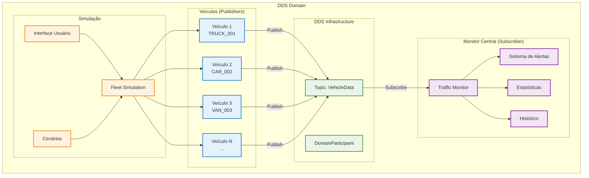
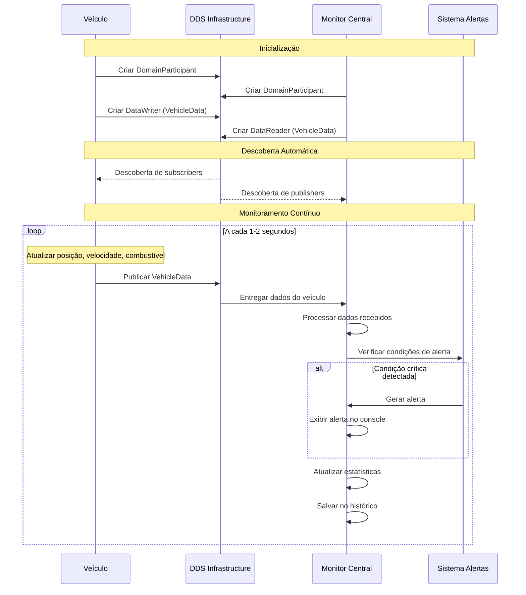

# Sistema de Monitoramento de Frota com Eclipse Cyclone DDS

Sistema completo de monitoramento de frota de veículos em tempo real usando Eclipse Cyclone DDS em Python. Implementa arquitetura publish/subscribe para comunicação distribuída entre veículos e central de monitoramento.

## Características

- **Arquitetura Publish/Subscribe**: Usa DomainParticipant, Topic, DataWriter e DataReader
- **Monitoramento em Tempo Real**: Rastreamento contínuo de posição, velocidade e status
- **Sistema de Alertas**: Detecção automática de situações críticas
- **Simulação Realística**: Movimento e consumo de combustível baseados em física
- **Múltiplos Tipos de Veículos**: Caminhão, van, carro, ônibus, motocicleta
- **Descoberta Automática**: Veículos se conectam automaticamente ao monitor
- **Escalabilidade**: Suporte a múltiplos veículos simultâneos
- **Interface Interativa**: Menu de simulação com cenários predefinidos

## Arquitetura do Sistema

### Diagrama de Arquitetura



### Diagrama de Sequência - Monitoramento



## Estrutura do Projeto

```
exemplo_frota_dds/
├── VehicleData.idl         # Definição IDL dos tipos de dados
├── vehicle_publisher.py    # Simulador de veículo individual
├── traffic_monitor.py      # Monitor central da frota
├── fleet_simulation.py     # Coordenador de simulação
├── demo_scenarios.py       # Cenários de demonstração
├── test_basic.py          # Testes básicos do sistema
├── run_example.py         # Script de execução rápida
├── requirements.txt       # Dependências Python
└── README.md             # Este arquivo
```

## Componentes Detalhados

### 1. Publicador de Veículos (vehicle_publisher.py)
- Simula movimento realístico com física básica
- Diferentes tipos de veículos com características únicas
- Consumo de combustível baseado na velocidade
- Geração de eventos aleatórios (paradas, mudanças de velocidade)
- Publicação periódica via DDS

### 2. Monitor de Tráfego (traffic_monitor.py)
- Recepção em tempo real de dados de todos os veículos
- Sistema de alertas configurável
- Estatísticas da frota em tempo real
- Detecção de veículos offline
- Histórico de dados com timestamps

### 3. Simulação de Frota (fleet_simulation.py)
- Interface interativa com menu de opções
- Coordenação de múltiplos veículos
- Cenários predefinidos de demonstração
- Controle de duração e parâmetros

### 4. Cenários de Demonstração (demo_scenarios.py)
- Cenários realísticos predefinidos
- Simulação de situações críticas
- Demonstração de capacidades do sistema

## Funcionalidades

### Publicador de Veículos (vehicle_publisher.py)
- Simula movimento realístico de veículos
- Publica dados de posição GPS, velocidade, combustível e status
- Diferentes tipos de veículos (caminhão, van, carro, ônibus, motocicleta)
- Simulação de consumo de combustível baseado na velocidade

### Monitor de Tráfego (traffic_monitor.py)
- Recebe dados de todos os veículos em tempo real
- Sistema de alertas para situações críticas:
  - Combustível baixo (< 15%)
  - Velocidade excessiva (> 90 km/h)
  - Status críticos (LOW_FUEL, EMERGENCY, BREAKDOWN)
  - Veículos offline
- Estatísticas da frota em tempo real
- Histórico de dados dos veículos

### Simulação Completa (fleet_simulation.py)
- Interface interativa com múltiplas opções de simulação
- Coordenação de múltiplos veículos simultaneamente
- Cenários de demonstração predefinidos
- Controle de duração e número de veículos

## Instalação

### ⚠️ Problema Comum: "Could not locate cyclonedds"

Se você encontrar o erro `Could not locate cyclonedds. Try to set CYCLONEDDS_HOME or CMAKE_PREFIX_PATH` ao executar `pip install -r requirements.txt`, isso significa que o **Cyclone DDS C não está instalado** no seu sistema.

**Solução Automática (Recomendada):**
```bash
# Execute o script de instalação automática
chmod +x install_cyclonedds.sh
./install_cyclonedds.sh
```

**Solução Manual:**
```bash
# Ubuntu/Debian
sudo apt update
sudo apt install -y libddsc0 cyclonedds-dev cmake build-essential

# Depois tente novamente
pip install -r requirements.txt
```

Para outras distribuições Linux, veja as instruções detalhadas abaixo.

### 1. Pré-requisitos

#### Eclipse Cyclone DDS C

**Opção A: Instalação via pacote (Ubuntu/Debian) (Recomendado)**
```bash
sudo apt update
sudo apt install -y libddsc0 cyclonedds-dev
```

**Opção B: Compilação do código fonte**
```bash
# Clone o repositório
git clone https://github.com/eclipse-cyclonedds/cyclonedds.git
cd cyclonedds

# Crie diretório de build
mkdir build
cd build

# Configure e compile
cmake ..
make -j$(nproc)
sudo make install

# Configure variáveis de ambiente permanentemente
echo 'export CYCLONEDDS_HOME=/usr/local' >> ~/.bashrc
echo 'export LD_LIBRARY_PATH=/usr/local/lib:$LD_LIBRARY_PATH' >> ~/.bashrc
echo 'export PKG_CONFIG_PATH=/usr/local/lib/pkgconfig:$PKG_CONFIG_PATH' >> ~/.bashrc
source ~/.bashrc
```

**Opção C: Usando cyclonedds**
```bash
# Instala a versão oficial do Cyclone DDS Python
pip install cyclonedds
```

**Nota:** Use `cyclonedds` (não `cyclonedx`) para a versão oficial dos bindings Python.

### 2. Ambiente Python

**IMPORTANTE:** Use sempre um ambiente virtual para evitar conflitos com o sistema.

```bash
# Navegue para o diretório do projeto
cd exemplo_frota_dds

# Crie ambiente virtual
python3 -m venv .venv

# Ative o ambiente virtual
# Linux/Mac:
source .venv/bin/activate
# Windows:
.venv\Scripts\activate

# Verifique se está no ambiente virtual (deve mostrar (.venv) no prompt)
# Instale dependências
pip install --upgrade pip setuptools wheel
pip install -r requirements.txt
```

**Se encontrar erro 'externally-managed-environment':**
```bash
# Certifique-se de que está no ambiente virtual
source .venv/bin/activate

# Ou use o pip do ambiente virtual diretamente
.venv/bin/pip install -r requirements.txt

# Ou instale python3-full se necessário
sudo apt install python3-full python3-venv
```

### 3. Verificação da Instalação

```bash
# Teste se o Cyclone DDS está funcionando
python -c "from cyclonedds.domain import DomainParticipant; print('Cyclone DDS OK')"

# Se houver erro, verifique se cyclonedds está instalado
pip list | grep cyclone
```

## Como Executar

### Opção 1: Simulação Completa (Recomendado)

Execute a simulação interativa que coordena tudo automaticamente:

```bash
python fleet_simulation.py
```

Este comando abrirá um menu interativo com as seguintes opções:
- Simulação rápida (3 veículos, 2 minutos)
- Simulação padrão (5 veículos, 5 minutos)
- Simulação extendida (10 veículos, 10 minutos)
- Simulação personalizada
- Demonstração de cenários

### Opção 2: Execução Manual Separada

Para entender melhor o funcionamento, você pode executar os componentes separadamente:

#### Terminal 1 - Monitor de Tráfego
```bash
python traffic_monitor.py
```

#### Terminal 2 - Primeiro Veículo
```bash
python vehicle_publisher.py TRUCK_001
```

#### Terminal 3 - Segundo Veículo
```bash
python vehicle_publisher.py CAR_002
```

#### Terminais Adicionais - Mais Veículos
```bash
python vehicle_publisher.py VAN_003
python vehicle_publisher.py BUS_004
```

## Estrutura de Dados DDS

### Definição IDL dos Tipos

```python
@dataclass
class Position(IdlStruct, typename="VehicleTypes::Position"):
    latitude: float       # Latitude em graus decimais (-90.0 a 90.0)
    longitude: float      # Longitude em graus decimais (-180.0 a 180.0)
    altitude: float       # Altitude em metros (nível do mar = 0)

@dataclass
class VehicleData(IdlStruct, typename="VehicleTypes::VehicleData"):
    vehicle_id: str       # Identificador único do veículo (ex: TRUCK_001)
    position: Position    # Posição GPS atual
    speed: float         # Velocidade atual em km/h
    fuel_level: float    # Nível de combustível (0.0-100.0%)
    status: str          # Status: OK, STOPPED, SPEEDING, LOW_FUEL, EMERGENCY
    timestamp: int       # Timestamp Unix em milissegundos
```

### Mapeamento de Tipos DDS

| Tipo Python | Tipo IDL | Tamanho | Descrição |
|-------------|----------|---------|----------|
| `str` | `string` | Variável | ID do veículo |
| `float` | `double` | 8 bytes | Coordenadas GPS, velocidade |
| `int` | `long long` | 8 bytes | Timestamp Unix |
| `Position` | `struct` | 24 bytes | Estrutura de posição |

### Configurações QoS

```python
class VehicleQoS:
    def __init__(self):
        self.qos = Qos(
            # Confiabilidade: Reliable para dados críticos
            Policy.Reliability.Reliable(duration(seconds=5)),
            
            # Durabilidade: Volatile (não persiste)
            Policy.Durability.Volatile,
            
            # Histórico: Mantém última amostra
            Policy.History.KeepLast(1),
            
            # Limites de recursos
            Policy.ResourceLimits(
                max_samples=1000,
                max_instances=100,
                max_samples_per_instance=10
            )
        )
```

## Exemplos de Saída

### Monitor de Tráfego
```
[RECEBIDO] TRUCK_001: Pos(-23.550123, -46.633456), Velocidade: 65.3 km/h, Combustível: 78.5%, Status: OK
ALERTA: Veículo CAR_002 em alta velocidade (95.2 km/h)
ALERTA: Veículo VAN_003 offline há 35 segundos

============================================================
ESTATÍSTICAS DA FROTA
============================================================
Total de veículos registrados: 5
Veículos ativos: 4
Velocidade média: 67.8 km/h
Nível médio de combustível: 65.2%
Distribuição de status:
  OK: 3 veículos
  SPEEDING: 1 veículos
Total de alertas: 12
============================================================
```

### Publicador de Veículo
```
[TRUCK_001] Pos: (-23.550789, -46.633123), Velocidade: 72.1 km/h, Combustível: 77.8%, Status: OK
[TRUCK_001] Pos: (-23.550856, -46.633089), Velocidade: 68.5 km/h, Combustível: 77.7%, Status: OK
```

## Configurações Avançadas

### Personalização de Veículos

No arquivo `vehicle_publisher.py`, você pode modificar:
- Posição inicial dos veículos
- Padrões de movimento
- Consumo de combustível
- Frequência de publicação

### Configuração de Alertas

No arquivo `traffic_monitor.py`, você pode ajustar:
- Limites para alertas (velocidade, combustível)
- Tempo para considerar veículo offline
- Tamanho do histórico de dados

## Solução de Problemas

### Erro: "externally-managed-environment"
Este erro ocorre em sistemas Linux modernos (Ubuntu 23.04+, Debian 12+) que protegem o ambiente Python do sistema.

```bash
# Solução 1: Use ambiente virtual (RECOMENDADO)
python3 -m venv .venv
source .venv/bin/activate
pip install -r requirements.txt

# Solução 2: Use o pip do ambiente virtual diretamente
.venv/bin/pip install cyclonedds

# Solução 3: Instale dependências do sistema se necessário
sudo apt install python3-full python3-venv python3-pip

# Solução 4: Use pipx para aplicações (não recomendado para este projeto)
pipx install cyclonedds
```

**NUNCA use --break-system-packages** pois pode danificar seu sistema.

### Problemas de Descoberta entre Máquinas

**Sintomas:** Veículos não conseguem se conectar ao monitor em máquinas diferentes

**Soluções:**

1. **Verificar conectividade de rede:**
```bash
# Teste ping entre as máquinas
ping <ip_do_monitor>

# Verifique se estão na mesma rede
ip route  # Linux
ipconfig  # Windows
```

2. **Configurar firewall (Linux):**
```bash
# Permitir tráfego DDS (portas UDP)
sudo ufw allow 7400:7500/udp

# Ou desabilitar temporariamente para teste
sudo ufw disable
```

3. **Configurar firewall (Windows):**
```powershell
# Permitir tráfego DDS no Windows Firewall
New-NetFirewallRule -DisplayName "Cyclone DDS" -Direction Inbound -Protocol UDP -LocalPort 7400-7500 -Action Allow
```

4. **Verificar multicast:**
```bash
# Teste se multicast está funcionando
# Terminal 1 (receptor):
socat UDP4-RECV:12345,ip-add-membership=224.0.0.1:eth0 -

# Terminal 2 (emissor):
echo "teste" | socat - UDP4-DATAGRAM:224.0.0.1:12345
```

5. **Configuração manual de descoberta (se multicast não funcionar):**
```bash
# Configure variável de ambiente para descoberta unicast
export CYCLONEDDS_URI="<dds><discovery><peers><peer address='192.168.1.100'/></peers></discovery></dds>"
```

### Erro: "Could not locate cyclonedds" ou "Getting requirements to build wheel did not run successfully"

Este erro ocorre quando o Cyclone DDS C não está instalado no sistema. O pacote Python `cyclonedds` precisa compilar contra as bibliotecas C.

**Solução 1: Instalar Cyclone DDS C (Recomendado)**
```bash
# Ubuntu/Debian
sudo apt update
sudo apt install -y libddsc0 cyclonedds-dev cmake build-essential

# Fedora/RHEL
sudo dnf install cyclonedds-devel cmake gcc-c++

# Arch Linux
sudo pacman -S cyclonedds cmake base-devel

# Depois instale o pacote Python
pip install cyclonedds
```

**Solução 2: Usar versão de desenvolvimento**
```bash
# Tente a versão de desenvolvimento diretamente do GitHub
pip install git+https://github.com/eclipse-cyclonedds/cyclonedds-python.git

# Ou force reinstalação sem cache
pip install --no-cache-dir --force-reinstall cyclonedds
```

**Solução 3: Compilar do código fonte**
```bash
# Clone e compile o Cyclone DDS C
git clone https://github.com/eclipse-cyclonedds/cyclonedds.git
cd cyclonedds
mkdir build && cd build
cmake ..
make -j$(nproc)
sudo make install

# Configure variáveis de ambiente
export CYCLONEDDS_HOME=/usr/local
export LD_LIBRARY_PATH=/usr/local/lib:$LD_LIBRARY_PATH
export PKG_CONFIG_PATH=/usr/local/lib/pkgconfig:$PKG_CONFIG_PATH

# Agora instale o pacote Python
pip install cyclonedds
```

**Verificação:**
```bash
# Teste se funcionou
python -c "from cyclonedds.domain import DomainParticipant; print('Cyclone DDS OK')"

# Verifique bibliotecas instaladas
ldconfig -p | grep cyclone

# Teste alternativo
python -c "import cyclonedds; print(f'Cyclone DDS versão: {cyclonedds.__version__}')"
```

### Erro: "No DDS implementation found"
```bash
# Verifique se Cyclone DDS C está instalado
ldconfig -p | grep cyclone

# Configure LD_LIBRARY_PATH se necessário
export LD_LIBRARY_PATH=/usr/local/lib:$LD_LIBRARY_PATH
```

### Veículos não aparecem no monitor
- Aguarde 5-10 segundos para descoberta automática DDS
- Verifique se todos os processos estão no mesmo domínio DDS
- Reinicie o monitor antes de iniciar os veículos
- Verifique logs de erro nos terminais
- Use domínio DDS diferente se houver conflitos: `--domain-id 1`

### Performance baixa
- Reduza número de veículos simultâneos
- Aumente intervalo de publicação nos veículos
- Use QoS Best Effort para menor latência
- Verifique recursos do sistema (CPU, memória, rede)
- Monitore uso de CPU com `htop` ou `top`

### Problemas de Rede
- Verifique se multicast está habilitado na rede
- Teste conectividade entre máquinas
- Configure descoberta unicast se necessário
- Verifique configurações de firewall
- Use `tcpdump` ou `wireshark` para debug de rede

## Como Funciona a Descoberta de Participantes

### Descoberta Automática DDS

O Eclipse Cyclone DDS usa **descoberta automática** para conectar participantes na rede. Não é necessário configurar endereços IP manualmente:

1. **Multicast UDP**: Por padrão, o DDS usa multicast para descobrir outros participantes na mesma rede
2. **Domínio DDS**: Participantes no mesmo domínio (domain_id) se descobrem automaticamente
3. **Tópicos**: Veículos e monitor se conectam através do tópico `VehicleData`

### Configuração para Múltiplas Máquinas

**Cenário: 1 monitor + 3 veículos em máquinas diferentes**

**Máquina 1 (Monitor):**
```bash
# Execute o monitor
python traffic_monitor.py
# Ou com domínio específico
python traffic_monitor.py --domain-id 1
```

**Máquina 2 (Veículo 1):**
```bash
# Execute o veículo (mesmo domain-id do monitor)
python vehicle_publisher.py TRUCK_001
# Ou com domínio específico
python vehicle_publisher.py TRUCK_001 --domain-id 1
```

**Máquina 3 (Veículo 2):**
```bash
# Execute o veículo (mesmo domain-id do monitor)
python vehicle_publisher.py CAR_002
# Ou com domínio específico
python vehicle_publisher.py CAR_002 --domain-id 1
```

**Requisitos de Rede:**
- Todas as máquinas devem estar na **mesma rede local**
- **Multicast deve estar habilitado** na rede
- **Firewall** não deve bloquear tráfego DDS (portas UDP)
- Usar o **mesmo domain_id** em todas as máquinas

### Arquitetura de Rede DDS

**Portas DDS Padrão:**
- **Discovery**: 7400 (multicast)
- **User Data**: 7401+ (unicast)
- **Multicast Group**: 224.0.0.1

**Configuração para WANs:**
```xml
<dds>
  <discovery>
    <peers>
      <peer address="192.168.1.100"/>
      <peer address="10.0.0.50"/>
    </peers>
  </discovery>
  <tracing>
    <verbosity>finest</verbosity>
  </tracing>
</dds>
```

## Desenvolvimento

### Adicionando Novos Tipos de Veículos

Modifique `vehicle_publisher.py` para adicionar novos tipos:
```python
VEHICLE_TYPES = {
    'TRUCK': {'max_speed': 90, 'fuel_consumption': 0.8},
    'CAR': {'max_speed': 120, 'fuel_consumption': 0.5},
    'VAN': {'max_speed': 100, 'fuel_consumption': 0.6},
    'BUS': {'max_speed': 80, 'fuel_consumption': 1.0},
    'MOTORCYCLE': {'max_speed': 140, 'fuel_consumption': 0.3},
    # Adicione novos tipos aqui
    'AMBULANCE': {'max_speed': 130, 'fuel_consumption': 0.7},
}
```

### Personalizando Alertas

Modifique configurações em `traffic_monitor.py`:
```python
class AlertConfig:
    SPEED_LIMIT = 90.0        # km/h
    LOW_FUEL_THRESHOLD = 15.0  # %
    OFFLINE_TIMEOUT = 30.0     # segundos
    
    # Adicione novos tipos de alerta
    CRITICAL_FUEL = 5.0       # %
    HIGH_SPEED = 120.0        # km/h
```

### Personalizando QoS

Modifique configurações em `vehicle_publisher.py` e `traffic_monitor.py`:
```python
self.qos = Qos(
    Policy.Reliability.Reliable(duration(seconds=5)),
    Policy.History.KeepLast(10),
    # Adicione outras políticas
)
```

## Conceitos DDS Demonstrados

### Arquitetura Publish/Subscribe
- **Desacoplamento**: Veículos e monitor não precisam conhecer uns aos outros
- **Escalabilidade**: Fácil adição de novos veículos ou monitores
- **Flexibilidade**: Diferentes tipos de dados podem usar tópicos separados

### Descoberta Automática
- **Zero Configuration**: Não requer configuração manual de endereços
- **Plug and Play**: Novos participantes são descobertos automaticamente
- **Tolerância a Falhas**: Reconexão automática após falhas de rede

### Quality of Service (QoS)
- **Reliability**: Garante entrega de dados críticos
- **Durability**: Controla persistência de dados
- **History**: Gerencia buffer de mensagens
- **Resource Limits**: Controla uso de memória

### Tópicos e Domínios
- **Organização**: Dados organizados por tópicos semânticos
- **Isolamento**: Domínios separam diferentes aplicações
- **Filtragem**: Subscribers podem filtrar dados por conteúdo

## Extensões Possíveis

1. **Interface Gráfica**: Visualização em mapa dos veículos com OpenStreetMap
2. **Banco de Dados**: Persistir dados históricos com PostgreSQL/MongoDB
3. **API REST**: Expor dados via FastAPI ou Flask
4. **Análise Avançada**: Machine learning para predição de problemas
5. **Integração IoT**: Conectar com dispositivos GPS reais
6. **Dashboard Web**: Interface web em tempo real com WebSockets
7. **Notificações**: Alertas via email, SMS ou push notifications
8. **Geofencing**: Alertas baseados em áreas geográficas
9. **Relatórios**: Geração automática de relatórios de frota
10. **Integração Cloud**: Deploy em AWS, Azure ou Google Cloud

## Documentação Técnica

### Performance e Métricas

- **Latência típica**: 1-5ms em rede local
- **Throughput**: Até 1000 mensagens/segundo por veículo
- **Descoberta**: 2-5 segundos para novos participantes
- **Uso de memória**: ~10MB por veículo, ~50MB para monitor
- **Uso de CPU**: <5% por veículo em operação normal

### Configurações Recomendadas

**Para desenvolvimento:**
```python
# QoS otimizado para desenvolvimento
dev_qos = Qos(
    Policy.Reliability.BestEffort,
    Policy.History.KeepLast(1),
    Policy.Durability.Volatile
)
```

**Para produção:**
```python
# QoS otimizado para produção
prod_qos = Qos(
    Policy.Reliability.Reliable(duration(seconds=10)),
    Policy.History.KeepLast(5),
    Policy.Durability.TransientLocal,
    Policy.ResourceLimits(max_samples=1000)
)
```

### Monitoramento e Debug

**Habilitar logs detalhados:**
```bash
# Variável de ambiente para debug
export CYCLONEDDS_URI="<dds><tracing><verbosity>finest</verbosity></tracing></dds>"

# Executar com logs
python traffic_monitor.py
```

**Ferramentas de debug:**
- `cyclonedds ls`: Lista participantes DDS
- `cyclonedds performance`: Testa performance
- `wireshark`: Análise de tráfego de rede
- `htop`: Monitoramento de recursos

## Licença

Este projeto é parte de um trabalho acadêmico sobre Eclipse Cyclone DDS e está disponível para fins educacionais e de pesquisa. 

**Uso Permitido:**
- Fins educacionais e acadêmicos
- Pesquisa e desenvolvimento
- Projetos pessoais e de aprendizado
- Base para projetos comerciais (com devidas atribuições)

**Restrições:**
- Não há garantias de funcionamento em produção
- Use por sua própria conta e risco
- Mantenha atribuições ao projeto original

## Recursos Adicionais

### Documentação Oficial
- [Eclipse Cyclone DDS](https://cyclonedds.io/)
- [Cyclone DDS Python](https://pypi.org/project/cyclonedds/)
- [DDS Specification](https://www.omg.org/spec/DDS/)

### Tutoriais e Exemplos
- [DDS Tutorial](https://github.com/eclipse-cyclonedds/cyclonedds/tree/master/examples)
- [Python Examples](https://github.com/eclipse-cyclonedds/cyclonedds-python/tree/main/examples)
- [Performance Tuning](https://cyclonedds.io/docs/cyclonedds-python/latest/performance/)

### Comunidade
- [GitHub Issues](https://github.com/eclipse-cyclonedds/cyclonedds/issues)
- [Stack Overflow](https://stackoverflow.com/questions/tagged/cyclone-dds)
- [Eclipse Forums](https://www.eclipse.org/forums/)

## Contato

Para dúvidas sobre a implementação:
1. Consulte a [documentação oficial do Cyclone DDS](https://cyclonedds.io/docs/)
2. Verifique os [exemplos oficiais](https://github.com/eclipse-cyclonedds/cyclonedds/tree/master/examples)
3. Procure ajuda na [comunidade DDS](https://stackoverflow.com/questions/tagged/cyclone-dds)
4. Consulte o trabalho acadêmico original sobre DDS

**Contribuições são bem-vindas!** Sinta-se livre para:
- Reportar bugs e problemas
- Sugerir melhorias
- Adicionar novos recursos
- Melhorar a documentação